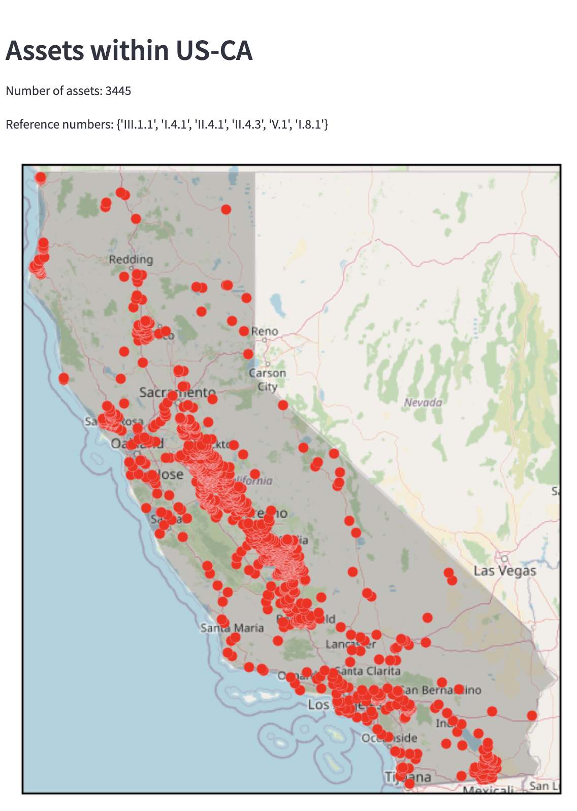

# Data Viewer
Streamlit app to visualize region boundaries and ClimateTRACE assets within it. This currently requires having the `ccglobal` database installed locally.

install requirements
```sh
pip install -r requirements.txt
```

run the app
```sh
streamlit run Homepage.py
```

## Figures


